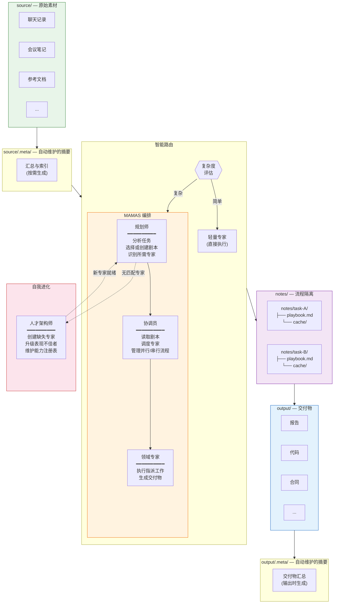

# MAMAS — 多自适应多智能体系统

[English](README.md) | 简体中文

一个 AI 原生的编排框架，将单个提示词转化为结构化的多专家协作流程。提供原始素材，指定任务目标——报告、代码、合同、文章——系统自动完成其余工作。

## 问题

AI 助手运行在扁平的、无状态的循环中：一个提示，一个响应，不记忆过程。当任务变得复杂——需要研究、规划、起草和审查时——你最终需要手动编排每一步。

## 解决方案

MAMAS 将**流程架构**引入 AI 协作。它将**输入内容**、**AI 工作方式**和**输出结果**分离为清晰、可复现的结构。

```
     你                          MAMAS                           你
  ┌─────────┐    ┌──────────────────────────────────┐    ┌────────────────┐
  │ source/ │───▶│  摘要 → 规划 → 执行 → 质检          │───▶│   output/      │
  │ (输入)   │    │         (全自动化)                │    │  (交付物)       │
  └─────────┘    └──────────────────────────────────┘    └────────────────┘
```

你只需关注两个界面：**输入**和**输出**。中间的一切都由系统管理。

## 架构



## 核心概念

### 1. 源材料 → 摘要 → 执行 → 输出

每个任务遵循相同的流水线：

1. **源材料**：你将原始素材放入 `source/` ——聊天记录、会议笔记、参考文档，任何内容
2. **摘要**：在任何专家读取源文件之前，系统在 `source/.meta/` 生成并缓存摘要。在后续任务中，摘要被重用——原始文件不会被不必要地重新读取
3. **执行**：专家在 `notes/` 下的隔离流程目录中工作，读取摘要（而非原始文件），在自己的 `cache/` 中生成中间产物
4. **输出**：最终交付物进入 `output/`。系统自动维护 `output/.meta/` 摘要层，使下游任务能够高效引用先前的交付物

**你只需处理 `source/` 和 `output/`。** 其余部分是基础设施。

### 2. 剧本驱动的流程

当任务进入 MAMAS 模式时，**规划师**生成（或重用）一个**剧本** —— 存储在 `notes/{task}/playbook.md` 的 Markdown 文件。剧本定义：

- 涉及哪些专家及其各自职责
- 执行顺序（并行或串行）
- 文档更新规则
- 质量标准

**协调员**读取剧本并执行。这意味着：

- **可重用模式**：用于"分析聊天记录并提取利益相关者动机"的剧本可以在类似任务到达时重用
- **上下文隔离**：每个任务获得自己的 `notes/` 子目录。任务 A 的专家永远看不到任务 B 的缓存

### 3. 三层路由

并非每个任务都需要完整编排。系统首先评估复杂度：

| 层级 | 何时使用 | 执行方式 | 成本 |
|------|---------|---------|------|
| **直接模式** | 简单的单领域任务 | 轻量专家立即处理 | 最小 |
| **完整专家** | 中等复杂度 | 具有完整方法论的全功能专家 | 中等 |
| **MAMAS 模式** | 多专家、跨领域 | 规划师 → 协调员 → 专家团队 | 完整 |

### 4. 自我进化

系统自我扩展。三个基础设施专家使其成为可能：

| 角色 | 职责 |
|------|------|
| **规划师** | 分析每个传入任务。当没有现有专家或剧本匹配时，触发创建新专家或剧本 |
| **协调员** | 执行剧本。评估专家输出质量。标记表现不佳者 |
| **人才架构师** | 按需设计新专家。当表现下降时升级现有专家。维护能力注册表 |

这创建了一个闭环：**任务 → 发现缺口 → 创建专家 → 完成任务 → 能力永久扩展**。

### 5. 模式驱动的约束

AI 生成的内容可能偏离业务需求或用户期望。MAMAS 通过**可重用的行为模式**解决这个问题：

- **是什么**: 预定义的约束，指定专家应如何执行任务（格式规则、质量标准、流程要求）
- **如何工作**: 规划师识别适用模式 → 协调员确保专家读取 → 专家应用约束 → 协调员验证合规性
- **模式类型**:
  - **领域模式**: 学术写作、法律合同、技术规格
  - **质量模式**: 基于证据的论证、一致性检查
  - **格式模式**: 结构化报告、API 文档
  - **流程模式**: 迭代优化、多轮审查

**结果**: 输出符合真实工作流程和标准，无需手动后期编辑。

### 6. Token 经济

AI 上下文窗口是有限的。MAMAS 将 token 视为稀缺资源：

- **摘要优先**：专家接收摘要，而非原始文件
- **轻量偏好**：70% 的任务使用轻量专家（每个 < 250 tokens）
- **缓存重用**：摘要跨任务持久化——无冗余处理
- **流程隔离**：每个任务仅加载所需内容

## 目录结构

```
MAMAS/
├── CLAUDE.md                  # AI 行为规范
├── SYSTEM.md                  # 路由规则与协议
├── README.md                  # 英文说明
├── README-CN.md              # 中文说明（本文件）
│
├── specialists/               # 专家智能体定义
│   ├── planner.md            # 任务分析与剧本创建
│   ├── coordinator.md        # 执行调度与质量保证
│   ├── talent-architect.md   # 专家生命周期管理
│   ├── {domain}.md           # 领域专家（可扩展）
│   └── .nano/                # 轻量变体（< 250 tokens）
│       └── {domain}.md
│
├── patterns/                  # 行为约束库
│   ├── README.md             # Pattern 系统文档
│   ├── .index.json           # Pattern 选择指南
│   ├── academic-writing.md   # 学术写作规范
│   ├── evidence-based.md     # 基于证据的论证
│   ├── structured-report.md  # 结构化报告模板
│   └── {pattern}.md          # 可扩展的模式定义
│
├── .claude/
│   └── experts-index.json    # 能力路由注册表
│
├── source/                    # 你的输入 — 原始素材
│   └── .meta/                # 自动维护的摘要
│       ├── index.json
│       └── summaries/
│
├── output/                    # 你的输出 — 交付物
│   └── .meta/                # 自动维护的交付物摘要
│       └── summaries/
│
└── notes/                     # 流程隔离工作空间
    └── {task}/
        ├── playbook.md       # 规划师生成的执行计划
        └── cache/            # 中间产物（仅限本任务）
            └── .context/     # 专家间上下文摘要
```

## 快速开始

```bash
# 1. 克隆到你的项目中
cp -r MAMAS/ your-project/MAMAS/

# 2. 添加原始素材
cp meeting-notes.md your-project/MAMAS/source/
cp chat-log.md your-project/MAMAS/source/

# 3. 提出任何需求
# "撰写竞争分析报告"
# "起草技术架构文档"
# "生成项目提案"
# 系统自动路由、规划、执行并交付。
```

## 使用指南

### 如何使用 MAMAS

MAMAS 设计为与支持 Claude Code 框架的任何 AI 助手配合使用。你只需用自然语言交互，系统自动处理编排。

#### 第一步：准备素材

将相关材料放入 `source/` 目录：

```bash
# 可以添加的素材示例：
source/
├── 会议记录-2024-01.md
├── 客户聊天记录.md
├── 竞品分析.pdf
├── 技术需求文档.md
└── 项目简介.docx
```

系统自动生成这些文件的摘要并缓存在 `source/.meta/summaries/` 中，以便高效重用。

#### 第二步：描述任务

直接告诉 AI 你需要什么。系统会自动：
- 路由到合适的专家
- 应用相关的行为模式
- 生成剧本（针对复杂任务）
- 在 `output/` 中生成交付物

**任务示例**：

```
简单任务（直接模式）：
"总结 source/ 中的会议记录"
→ 上下文合成器直接处理

中等任务（完整专家）：
"基于 source/竞品分析.pdf 分析竞争格局"
→ 研究分析师使用完整方法论执行

复杂任务（MAMAS 模式）：
"创建一份完整的商业提案，包括市场分析、技术架构、
成本评估和实施计划"
→ 规划师 → 协调员 → 多个专家协作
```

#### 第三步：查看交付物

所有输出出现在 `output/` 目录：

```
output/
├── 商业提案.md
├── 技术架构.md
└── 实施计划.md
```

每个输出自动在 `output/.meta/summaries/` 中生成摘要，供下游任务使用。

### 理解路由机制

MAMAS 使用智能路由来优化成本和延迟：

**当你提出请求时，系统评估：**

1. **这是简单的单领域任务吗？**
   - 是 → 直接模式（轻量专家，约 150-200 tokens）
   - 示例："总结这份文档"

2. **需要深度方法论但只需单个专家？**
   - 是 → 完整专家模式（约 1500-2500 tokens）
   - 示例："进行竞争分析"

3. **需要多个专家或跨领域工作？**
   - 是 → MAMAS 模式（规划师 + 协调员 + 专家团队）
   - 示例："创建完整的项目提案"

你无需指定模式 — 系统根据任务复杂度自动决策。

### 使用模式（Patterns）

模式确保你的输出符合现实世界的标准和要求。

**自动模式应用**：

当你请求任务时，规划师自动识别适用的模式：

```
请求："撰写关于多智能体系统的学术论文"

规划师选择：
- patterns/academic-writing.md（确保学术结构）
- patterns/evidence-based.md（要求引用支持）
- patterns/structured-report.md（强制标准章节）

结果：输出遵循学术规范，无需你指定细节
```

**可用模式**：

- `academic-writing.md` — 学术论文、研究报告
- `evidence-based.md` — 任何需要可信论证的文档
- `structured-report.md` — 正式报告、提案

**扩展模式**：

按照 `patterns/README.md` 中的模板在 `patterns/` 创建新模式。系统将自动发现并使用它们。

### 高级用法

#### 重用剧本

当 MAMAS 模式为任务创建剧本时，它存储在 `notes/{task}/playbook.md`。类似的未来任务自动重用经过验证的剧本：

```
首次："分析聊天记录以提取客户痛点"
→ 创建 notes/chat-analysis/playbook.md

下次："分析这些新的聊天记录提取痛点"
→ 重用现有剧本（无规划开销）
```

#### 迭代工作流

基于先前输出构建：

```
步骤 1："基于 source/市场数据.csv 分析市场"
→ 生成 output/市场分析.md

步骤 2："基于市场分析，提出商业策略"
→ 读取 output/市场分析.md 的摘要
→ 生成 output/商业策略.md

步骤 3："为商业策略创建实施路线图"
→ 基于先前输出构建
```

每一步都重用缓存的摘要 — 无冗余重读。

#### 自定义专家

系统可以通过人才架构师按需创建新专家：

```
请求："分析法律合同的合规风险"

系统检测到：
- 没有现有专家匹配"法律合同分析"
- 调用人才架构师
- 创建 specialists/legal-analyst.md
- 更新 .claude/experts-index.json
- 执行任务

未来任务：
- "法律合同"关键词现在路由到新专家
```

### 最佳实践

1. **清晰组织源材料**：使用描述性文件名，如 `客户反馈-2024-Q1.md` 而非 `笔记.md`

2. **从简单开始，逐步扩展**：从简单任务开始理解路由，然后处理复杂的多专家工作流

3. **查看剧本**：MAMAS 模式任务后，检查 `notes/{task}/playbook.md` 了解系统如何分解你的请求

4. **利用模式**：当输出不符合预期时，考虑创建自定义模式而非反复修正

5. **信任摘要**：系统的摘要缓存（`source/.meta/` 和 `output/.meta/`）显著减少 token 使用 — 不要绕过它

### 故障排除

**"输出不符合我的要求"**
- 检查 `patterns/` 中是否存在合适的模式
- 创建定义你具体要求的自定义模式
- 规划师将自动应用于未来类似任务

**"任务似乎使用了错误的专家"**
- 路由决策基于 `.claude/experts-index.json` 中的关键词
- 你可以在请求中包含特定术语来引导路由
- 示例："作为技术架构师，设计..." vs "设计..."

**"想看过程，不只是结果"**
- 查看 `notes/{task}/playbook.md` 了解执行计划
- 查看 `notes/{task}/cache/` 了解中间产物
- 这些展示系统如何分解和执行你的任务

## 许可证

[MIT](LICENSE)
