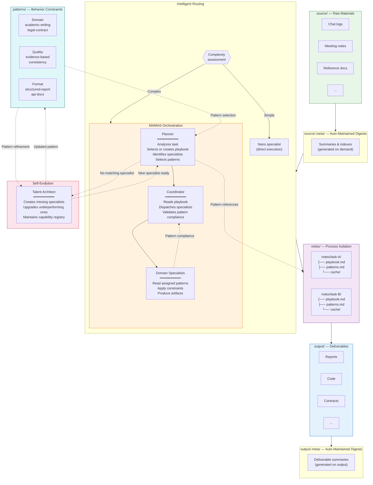

# MAMAS — Multi-Adaptive-Multi-Agent System

English | [简体中文](README-CN.md)

An AI-native orchestration framework that turns a single prompt into structured, multi-specialist workflows. Feed it raw materials, give it a task — reports, code, contracts, articles — it handles the rest.

## The Problem

AI assistants operate in a flat, stateless loop: one prompt, one response, no memory of process. When tasks grow complex — requiring research, planning, drafting, and review — you end up manually orchestrating every step.

## The Solution

MAMAS introduces **process architecture** into AI collaboration. It separates **what you put in**, **how AI works**, and **what comes out** into a clean, reproducible structure.

```
     You                          MAMAS                           You
  ┌─────────┐    ┌──────────────────────────────────┐    ┌────────────────┐
  │ source/ │───▶│  Digest → Plan → Execute → QA    │───▶│   output/      │
  │ (input) │    │         (fully automated)        │    │ (deliverables) │
  └─────────┘    └──────────────────────────────────┘    └────────────────┘
```

You focus on two surfaces: **input** and **output**. Everything in between is managed.

## Architecture



## Core Concepts

### 1. Source → Digest → Execute → Output

Every task follows the same pipeline:

1. **Source**: You drop raw materials into `source/` — chat logs, meeting notes, reference documents, anything
2. **Digest**: Before any specialist reads a source file, the system generates and caches a digest in `source/.meta/`. On subsequent tasks, the digest is reused — the raw file is never re-read unnecessarily
3. **Execute**: Specialists work in isolated process directories under `notes/`, reading digests (not raw files), producing intermediate artifacts in their own `cache/`
4. **Output**: Final deliverables land in `output/`. The system auto-maintains an `output/.meta/` digest layer so downstream tasks can reference prior deliverables efficiently

**You only touch `source/` and `output/`.** The rest is infrastructure.

### 2. Playbook-Driven Processes

When a task enters MAMAS mode, the **Planner** generates (or reuses) a **playbook** — a Markdown file stored at `notes/{task}/playbook.md`. The playbook defines:

- Which specialists are involved and what each does
- The execution sequence (parallel vs. sequential)
- Document update rules
- Quality criteria

The **Coordinator** reads the playbook and executes it. This means:

- **Reusable patterns**: A playbook for "analyze chat logs and extract stakeholder motivations" can be reused whenever a similar task arrives
- **Context isolation**: Each task gets its own `notes/` subdirectory. Specialists in task A never see task B's cache

### 3. Three-Tier Routing

Not every task needs full orchestration. The system evaluates complexity first:

| Tier | When | What Happens | Cost |
|------|------|-------------|------|
| **Direct** | Simple, single-domain task | Nano specialist handles it immediately | Minimal |
| **Full Specialist** | Moderate complexity | Full specialist with complete methodology | Moderate |
| **MAMAS Mode** | Multi-specialist, cross-domain | Planner → Coordinator → Specialist team | Full |

### 4. Self-Evolution

The system extends itself. Three infrastructure specialists make this possible:

| Role | Responsibility |
|------|---------------|
| **Planner** | Analyzes every incoming task. When no existing specialist or playbook matches, triggers creation of new ones |
| **Coordinator** | Executes playbooks. Evaluates specialist output quality. Flags underperformance |
| **Talent Architect** | Designs new specialists on demand. Upgrades existing ones when performance degrades. Maintains the capability registry |

This creates a closed loop: **task → gap detected → specialist created → task completed → capability permanently expanded**.

### 5. Pattern-Driven Constraints

AI-generated content can drift from business requirements or user expectations. MAMAS solves this with **reusable behavior patterns**:

- **What they are**: Pre-defined constraints that specify how specialists should execute tasks (format rules, quality standards, process requirements)
- **How they work**: Planner identifies applicable patterns → Coordinator ensures specialists read them → specialists apply constraints → Coordinator validates compliance
- **Pattern types**:
  - **Domain patterns**: Academic writing, legal contracts, technical specs
  - **Quality patterns**: Evidence-based argumentation, consistency checks
  - **Format patterns**: Structured reports, API documentation
  - **Process patterns**: Iterative refinement, multi-round review

**Result**: Output matches real workflows and standards without manual post-editing.

### 6. Token Economy

AI context windows are finite. MAMAS treats tokens as a scarce resource:

- **Digest-first**: Specialists receive summaries, not raw files
- **Nano preference**: 70% of tasks use nano specialists (< 250 tokens each)
- **Cache reuse**: Digests persist across tasks — no redundant processing
- **Process isolation**: Each task loads only what it needs

## Directory Structure

```
MAMAS/
├── CLAUDE.md                  # AI behavior specification
├── SYSTEM.md                  # Routing rules & protocol
├── README.md                  # This file
│
├── specialists/               # Specialist agent definitions
│   ├── planner.md            # Task analysis & playbook creation
│   ├── coordinator.md        # Execution dispatch & quality assurance
│   ├── talent-architect.md   # Specialist lifecycle management
│   ├── {domain}.md           # Domain specialists (extensible)
│   └── .nano/                # Lightweight variants (< 250 tokens)
│       └── {domain}.md
│
├── patterns/                  # Behavior constraint library
│   ├── README.md             # Pattern system documentation
│   ├── .index.json           # Pattern selection guide
│   ├── academic-writing.md   # Academic writing standards
│   ├── evidence-based.md     # Evidence-based argumentation
│   ├── structured-report.md  # Formal report templates
│   └── {pattern}.md          # Extensible pattern definitions
│
├── .claude/
│   └── experts-index.json    # Capability routing registry
│
├── source/                    # YOUR INPUT — raw materials
│   └── .meta/                # Auto-maintained digests
│       ├── index.json
│       └── summaries/
│
├── output/                    # YOUR OUTPUT — deliverables
│   └── .meta/                # Auto-maintained deliverable digests
│       └── summaries/
│
└── notes/                     # Process-isolated workspaces
    └── {task}/
        ├── playbook.md       # Planner-generated execution plan
        └── cache/            # Intermediate artifacts (this task only)
            └── .context/     # Inter-specialist context summaries
```

## Quick Start

```bash
# 1. Clone into your project
cp -r MAMAS/ your-project/MAMAS/

# 2. Add raw materials
cp meeting-notes.md your-project/MAMAS/source/
cp chat-log.md your-project/MAMAS/source/

# 3. Ask for anything
# "Write a competitive analysis report"
# "Draft a technical architecture document"
# "Generate a project proposal"
# The system routes, plans, executes, and delivers.
```

## Usage Guide

### How to Use MAMAS

MAMAS is designed to work with any AI assistant that supports the Claude Code framework. You simply interact in natural language, and the system handles the orchestration automatically.

#### Step 1: Prepare Your Materials

Place any relevant materials in the `source/` directory:

```bash
# Examples of what you can add:
source/
├── meeting-notes-2024-01.md
├── customer-chat-log.md
├── competitor-analysis.pdf
├── technical-requirements.md
└── project-brief.docx
```

The system automatically generates digests of these files and caches them in `source/.meta/summaries/` for efficient reuse.

#### Step 2: Describe Your Task

Simply tell the AI what you need. The system automatically:
- Routes to the appropriate specialist(s)
- Applies relevant behavior patterns
- Generates a playbook (for complex tasks)
- Produces deliverables in `output/`

**Example Tasks**:

```
Simple (Direct Mode):
"Summarize the meeting notes in source/"
→ Context Synthesizer handles it directly

Moderate (Full Specialist):
"Analyze the competitive landscape based on source/competitor-analysis.pdf"
→ Research Analyst executes with full methodology

Complex (MAMAS Mode):
"Create a comprehensive business proposal including market analysis,
technical architecture, cost assessment, and implementation plan"
→ Planner → Coordinator → Multiple specialists collaborate
```

#### Step 3: Review Deliverables

All outputs appear in the `output/` directory:

```
output/
├── business-proposal.md
├── technical-architecture.md
└── implementation-plan.md
```

Each output automatically gets a digest in `output/.meta/summaries/` for downstream tasks.

### Understanding Routing

MAMAS uses intelligent routing to optimize cost and latency:

**When you make a request, the system evaluates:**

1. **Is this a simple, single-domain task?**
   - YES → Direct Mode (nano specialist, ~150-200 tokens)
   - Example: "Summarize this document"

2. **Does it need deep methodology but single specialist?**
   - YES → Full Specialist Mode (~1500-2500 tokens)
   - Example: "Conduct competitive analysis"

3. **Does it require multiple specialists or cross-domain work?**
   - YES → MAMAS Mode (Planner + Coordinator + Specialists)
   - Example: "Create a complete project proposal"

You don't need to specify the mode — the system decides automatically based on task complexity.

### Working with Patterns

Patterns ensure your outputs match real-world standards and requirements.

**Automatic Pattern Application**:

When you request a task, the Planner automatically identifies applicable patterns:

```
Request: "Write an academic paper on multi-agent systems"

Planner selects:
- patterns/academic-writing.md (ensures academic structure)
- patterns/evidence-based.md (requires citation support)
- patterns/structured-report.md (enforces standard sections)

Result: Output follows academic conventions without you specifying details
```

**Available Patterns**:

- `academic-writing.md` — Academic papers, research reports
- `evidence-based.md` — Any document requiring credible arguments
- `structured-report.md` — Formal reports, proposals

**Extending Patterns**:

Create new patterns in `patterns/` following the template in `patterns/README.md`. The system will automatically discover and use them.

### Advanced Usage

#### Reusing Playbooks

When MAMAS mode creates a playbook for a task, it's stored in `notes/{task}/playbook.md`. Similar future tasks automatically reuse proven playbooks:

```
First time: "Analyze chat logs to extract customer pain points"
→ Creates notes/chat-analysis/playbook.md

Next time: "Analyze these new chat logs for pain points"
→ Reuses the existing playbook (no planning overhead)
```

#### Iterative Workflows

Build on previous outputs:

```
Step 1: "Analyze the market based on source/market-data.csv"
→ Produces output/market-analysis.md

Step 2: "Based on the market analysis, propose a business strategy"
→ Reads digest of output/market-analysis.md
→ Produces output/business-strategy.md

Step 3: "Create an implementation roadmap for the business strategy"
→ Builds on previous outputs
```

Each step reuses cached digests — no redundant re-reading.

#### Custom Specialists

The system can create new specialists on demand via the Talent Architect:

```
Request: "Analyze legal contracts for compliance risks"

System detects:
- No existing specialist matches "legal contract analysis"
- Invokes Talent Architect
- Creates specialists/legal-analyst.md
- Updates .claude/experts-index.json
- Executes the task

Future tasks:
- "legal contract" keywords now route to the new specialist
```

### Best Practices

1. **Organize source materials clearly**: Use descriptive filenames like `customer-feedback-2024-Q1.md` instead of `notes.md`

2. **Start simple, scale up**: Begin with straightforward tasks to understand routing, then tackle complex multi-specialist workflows

3. **Review playbooks**: After a MAMAS-mode task, check `notes/{task}/playbook.md` to understand how the system decomposed your request

4. **Leverage patterns**: When output doesn't match your expectations, consider creating a custom pattern rather than repeatedly correcting

5. **Trust the digests**: The system's digest cache (`source/.meta/` and `output/.meta/`) significantly reduces token usage — don't bypass it

### Troubleshooting

**"Output doesn't match my requirements"**
- Check if an appropriate pattern exists in `patterns/`
- Create a custom pattern defining your specific requirements
- The Planner will auto-apply it to future similar tasks

**"Task seems to use the wrong specialist"**
- The routing decision is based on keywords in `.claude/experts-index.json`
- You can guide routing by including specific terms in your request
- Example: "As a technical architect, design..." vs "Design..."

**"Want to see the process, not just results"**
- Check `notes/{task}/playbook.md` for the execution plan
- Review `notes/{task}/cache/` for intermediate artifacts
- These show exactly how the system broke down and executed your task

## License

[MIT](LICENSE)
