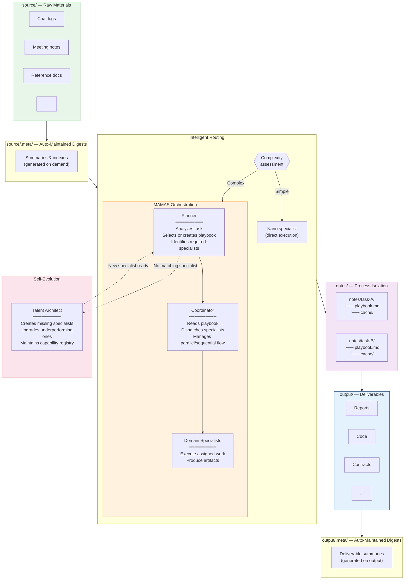

# MAMAS — Multi-Adaptive-Multi-Agent System

An AI-native orchestration framework that turns a single prompt into structured, multi-specialist workflows. Feed it raw materials, give it a task — reports, code, contracts, articles — it handles the rest.

## The Problem

AI assistants operate in a flat, stateless loop: one prompt, one response, no memory of process. When tasks grow complex — requiring research, planning, drafting, and review — you end up manually orchestrating every step.

## The Solution

MAMAS introduces **process architecture** into AI collaboration. It separates **what you put in**, **how AI works**, and **what comes out** into a clean, reproducible structure.

```
     You                          MAMAS                           You
  ┌─────────┐    ┌──────────────────────────────────┐    ┌────────────────┐
  │ source/ │───▶│  Digest → Plan → Execute → QA    │───▶│   output/      │
  │ (input) │    │         (fully automated)        │    │ (deliverables) │
  └─────────┘    └──────────────────────────────────┘    └────────────────┘
```

You focus on two surfaces: **input** and **output**. Everything in between is managed.

## Architecture



## Core Concepts

### 1. Source → Digest → Execute → Output

Every task follows the same pipeline:

1. **Source**: You drop raw materials into `source/` — chat logs, meeting notes, reference documents, anything
2. **Digest**: Before any specialist reads a source file, the system generates and caches a digest in `source/.meta/`. On subsequent tasks, the digest is reused — the raw file is never re-read unnecessarily
3. **Execute**: Specialists work in isolated process directories under `notes/`, reading digests (not raw files), producing intermediate artifacts in their own `cache/`
4. **Output**: Final deliverables land in `output/`. The system auto-maintains an `output/.meta/` digest layer so downstream tasks can reference prior deliverables efficiently

**You only touch `source/` and `output/`.** The rest is infrastructure.

### 2. Playbook-Driven Processes

When a task enters MAMAS mode, the **Planner** generates (or reuses) a **playbook** — a Markdown file stored at `notes/{task}/playbook.md`. The playbook defines:

- Which specialists are involved and what each does
- The execution sequence (parallel vs. sequential)
- Document update rules
- Quality criteria

The **Coordinator** reads the playbook and executes it. This means:

- **Reusable patterns**: A playbook for "analyze chat logs and extract stakeholder motivations" can be reused whenever a similar task arrives
- **Context isolation**: Each task gets its own `notes/` subdirectory. Specialists in task A never see task B's cache

### 3. Three-Tier Routing

Not every task needs full orchestration. The system evaluates complexity first:

| Tier | When | What Happens | Cost |
|------|------|-------------|------|
| **Direct** | Simple, single-domain task | Nano specialist handles it immediately | Minimal |
| **Full Specialist** | Moderate complexity | Full specialist with complete methodology | Moderate |
| **MAMAS Mode** | Multi-specialist, cross-domain | Planner → Coordinator → Specialist team | Full |

### 4. Self-Evolution

The system extends itself. Three infrastructure specialists make this possible:

| Role | Responsibility |
|------|---------------|
| **Planner** | Analyzes every incoming task. When no existing specialist or playbook matches, triggers creation of new ones |
| **Coordinator** | Executes playbooks. Evaluates specialist output quality. Flags underperformance |
| **Talent Architect** | Designs new specialists on demand. Upgrades existing ones when performance degrades. Maintains the capability registry |

This creates a closed loop: **task → gap detected → specialist created → task completed → capability permanently expanded**.

### 5. Token Economy

AI context windows are finite. MAMAS treats tokens as a scarce resource:

- **Digest-first**: Specialists receive summaries, not raw files
- **Nano preference**: 70% of tasks use nano specialists (< 250 tokens each)
- **Cache reuse**: Digests persist across tasks — no redundant processing
- **Process isolation**: Each task loads only what it needs

## Directory Structure

```
MAMAS/
├── CLAUDE.md                  # AI behavior specification
├── SYSTEM.md                  # Routing rules & protocol
├── README.md                  # This file
│
├── specialists/               # Specialist agent definitions
│   ├── planner.md            # Task analysis & playbook creation
│   ├── coordinator.md        # Execution dispatch & quality assurance
│   ├── talent-architect.md   # Specialist lifecycle management
│   ├── {domain}.md           # Domain specialists (extensible)
│   └── .nano/                # Lightweight variants (< 250 tokens)
│       └── {domain}.md
│
├── .claude/
│   └── experts-index.json    # Capability routing registry
│
├── source/                    # YOUR INPUT — raw materials
│   └── .meta/                # Auto-maintained digests
│       ├── index.json
│       └── summaries/
│
├── output/                    # YOUR OUTPUT — deliverables
│   └── .meta/                # Auto-maintained deliverable digests
│       └── summaries/
│
└── notes/                     # Process-isolated workspaces
    └── {task}/
        ├── playbook.md       # Planner-generated execution plan
        └── cache/            # Intermediate artifacts (this task only)
            └── .context/     # Inter-specialist context summaries
```

## Quick Start

```bash
# 1. Clone into your project
cp -r MAMAS/ your-project/MAMAS/

# 2. Add raw materials
cp meeting-notes.md your-project/MAMAS/source/
cp chat-log.md your-project/MAMAS/source/

# 3. Ask for anything
# "Write a competitive analysis report"
# "Draft a technical architecture document"
# "Generate a project proposal"
# The system routes, plans, executes, and delivers.
```

## License

[MIT](LICENSE)
